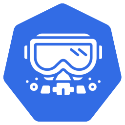

# Pod dive



A `kubectl` [Krew](https://krew.dev) plugin to dive into your Kubernetes nodes workloads.

Icon art made by [Smashicons](https://www.flaticon.com/authors/smashicons) from [Flaticon](https://www.flaticon.com/). We had one before Krew itself, go figure.

## Quick Start

If you don't use Krew to manage `kubectl` plugins [you can simply download the binary here](https://github.com/caiobegotti/Pod-Dive/releases) and put it in your PATH.

```
kubectl krew install pod-dive
kubectl pod-dive
```

## Why use it

It's much faster than running multiple `kubectl` commands and having to scroll up and down to look for critical pod info.

## What does it look like

```
$ kubectl pod-dive --help
Dives into a node after the desired pod and returns data associated
with the pod no matter where it is running, such as its origin workload,
namespace, the node where it is running and its node pod siblings, as
well basic health status of it all.

The purpose is to have meaningful pod info at a glance without needing to
run multiple kubectl commands to see what else is running next to your
pod in a given node inside a huge cluster, because sometimes all
you've got from an alert is the pod name.

Usage:
  pod-dive [pod name] [flags]

Examples:

Cluster-wide dive after a pod
$ kubectl pod-dive thanos-store-0

Restricts the dive to a namespace (faster in big clusters)
$ kubectl pod-dive elasticsearch-curator-1576112400-97htk -n logging
```

```
$ kubectl pod-dive kafka-operator-kafka-0
Diving after pod kafka-operator-kafka-1:

[node]      gke-staging-default-pool-acca72c6-klsn [ready]
[namespace]    ├─┬─ kafka
[type]         │ └─┬─ statefulset
[workload]     │   └─┬─ kafka-operator-kafka [3 replicas]
[pod]          │     └─┬─ kafka-operator-kafka-0 [pending]
[containers]   │       ├─── kafka [1 restart]
               │       ├─── tls-sidecar [0 restarts]
               │       ├─── vault-renewer [2 restarts]
               │       ├─── vault-authenticator [init, 0 restarts]
               │       └─── kafka-init [init, 0 restarts]
[siblings]     ├─── cassandra-0
               ├─── debug-b58f6f7f8-hbfw5
               ├─── ignite-memory-web-agent-cc75c9987-nfh6p
               ├─── jaeger-agent-daemonset-gmhm7
               ├─── jaeger-query-7dc45cfc9f-mzfg6
               ├─── kafka-operator-zookeeper-0
               ├─── calico-node-dgvht
               ├─── calico-typha-65bfd5544b-kjjjh
               ├─── fluentd-gcp-scaler-6bc97c54b4-xftsm
               ├─── fluentd-gcp-v3.1.1-b9zhf
               ├─── ip-masq-agent-jtjxz
               ├─── kube-dns-autoscaler-bb58c6784-j9n4h
               ├─── kube-proxy-gke-staging-default-pool-acca72c6-klsn
               ├─── metrics-server-v0.3.1-7b4d7f457-v6mfp
               ├─── prometheus-to-sd-47n9b
               ├─── vpa-recommender-8667dc8d75-9j4vl
               ├─── fluent-bit-rj8cn
               ├─── prometheus-operator-grafana-7f478cc944-g7rvw
               ├─── prometheus-operator-kube-state-metrics-79486d7f6d-9r9q5
               ├─── prometheus-operator-operator-777f86b5f7-njr9n
               └─── prometheus-operator-prometheus-node-exporter-8w8tv

Stuck:
    kafka imagepullbackoff
Terminations:
    vault-renewer error [code 7]
```
